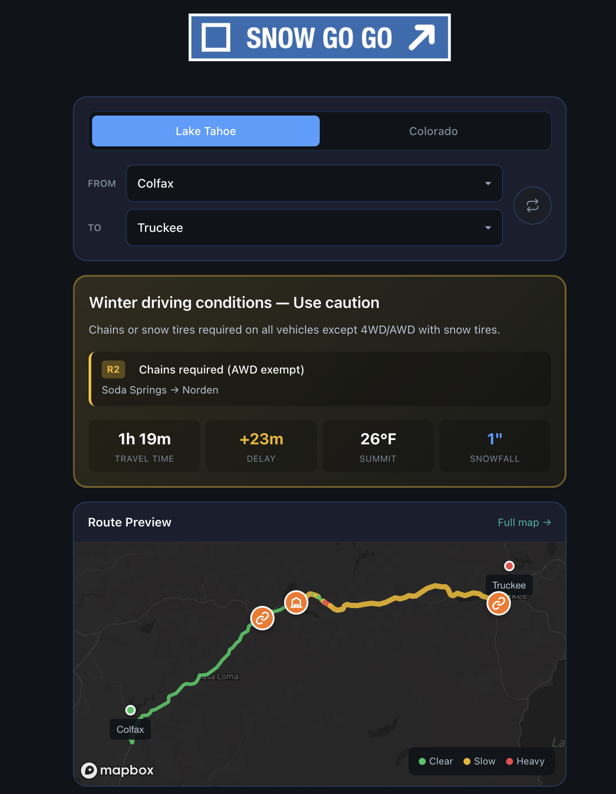
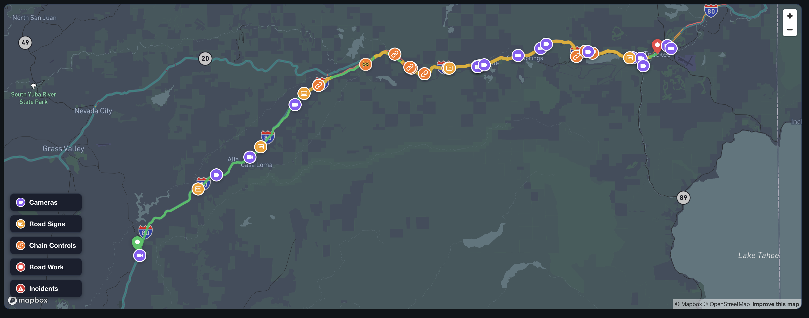
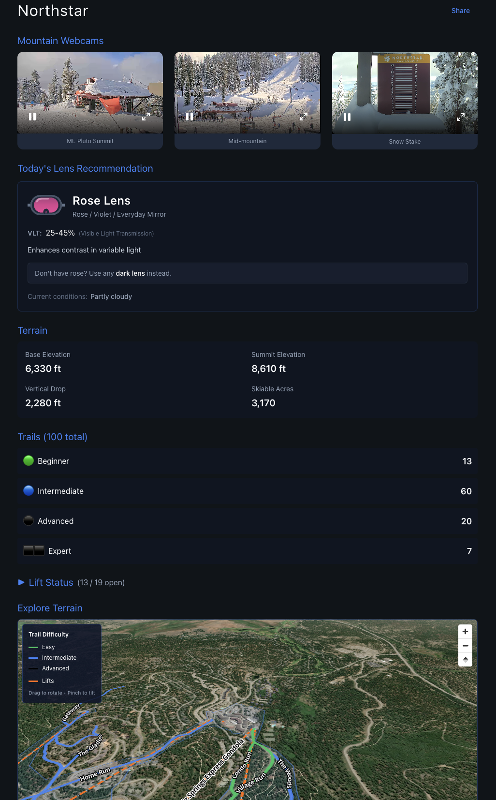

# Snow Go Go

Real-time road conditions and trip planning for mountain destinations. Check chain controls, traffic, webcams, and resort status — all in one place.

**Live Site:** [snowgogo.com](https://snowgogo.com)



---

## Features

### Route Planner
Interactive maps with real-time traffic visualization. See conditions at a glance with color-coded route segments, chain control markers, road signs, cameras, and incidents along your route.



### Chain Control Status
Real-time chain requirements from state DOTs (R-0 through R-3), with distance-based breakdowns showing exactly which segments require chains.

### Travel Times & Delays
Live traffic data with smart delay detection. See current travel time, delay vs normal conditions, summit temperature, and recent snowfall.

### Road Cameras
Live camera feeds from CalTrans, Nevada DOT, and Colorado DOT — filtered and ordered by your selected route.

### Resort Information
Detailed pages for 15+ ski resorts with live mountain webcams, terrain stats, trail maps, lift status, and goggle lens recommendations based on current conditions.



---

## Supported Regions

| Origin | Destination | Corridors |
|--------|-------------|-----------|
| Bay Area | Lake Tahoe | I-80 (Donner Pass), US-50 (Echo Summit), SR-88 (Carson Pass) |
| Reno | Lake Tahoe | I-80, Mt Rose Highway, US-50 |
| Denver | Colorado Ski Country | I-70 (Eisenhower Tunnel) |

---

## Tech Stack

| Layer | Technologies |
|-------|--------------|
| Frontend | React 19, Vite, Tailwind CSS |
| Maps | Mapbox GL JS, react-map-gl, Turf.js |
| State | Zustand, SWR |
| Backend | Vercel Serverless Functions |
| Streaming | HLS.js for live webcam feeds |
| Testing | Vitest, React Testing Library |

---

## Data Sources

- **Google Routes API** — Directions, travel times, real-time traffic
- **Caltrans** — Chain controls, CMS signs, road cameras, weather sensors
- **Nevada DOT** — Cameras, message signs, road conditions
- **Colorado DOT** — Chain laws, road conditions, cameras
- **CHP** — Real-time California highway incidents
- **Snow Go Go Resort API** — Lift status, trail conditions, snow reports (see below)

---

## Snow Go Go Resort API

A companion data aggregation service that powers the resort information on Snow Go Go. Collects and normalizes real-time data from resort websites into a unified API.

### Features
- **Lift Status** — Open, closed, hold, or scheduled states for every lift
- **Trail Conditions** — Open/closed status with grooming info and difficulty levels
- **Snow Reports** — Base depth, summit depth, and recent snowfall
- **Weather** — Temperature, conditions, and wind at each resort
- **Mountain Zones** — Trails and lifts organized by geographic area

### Coverage
- **Lake Tahoe** — 11 resorts (Palisades, Northstar, Heavenly, Kirkwood, Sugar Bowl, etc.)
- **Colorado** — I-70 corridor resorts
- **Utah** — In development

### Tech Stack
| Component | Technology |
|-----------|------------|
| Runtime | Node.js |
| Automation | GitHub Actions (runs every 15 minutes) |
| Output | Static JSON via GitHub Pages |
| Data Collection | Resort APIs + web scraping where needed |

### Architecture
```
Resort Websites → Crawlers → Normalize to Schema → JSON API → Snow Go Go Frontend
```

Each resort has a dedicated crawler that handles its specific data format. All data is normalized to a common schema before being published, allowing the frontend to consume resort data uniformly regardless of source.

---

## Engineering Principles

**Adapter Pattern for Multi-Region Support**
Each state's DOT API is normalized through dedicated adapters, allowing the UI to remain region-agnostic. Adding a new region means writing one adapter — no changes to hooks or components.

**Progressive Data Loading**
Show useful data immediately, fetch real-time updates in the background, and gracefully fall back to estimates if APIs are unavailable.

**Shared Design System**
Consistent components and patterns across all pages — same card layouts, status indicators, and interactions whether on the homepage, route map, or resort pages.

---

*This is a portfolio showcase. Source code is private.*
